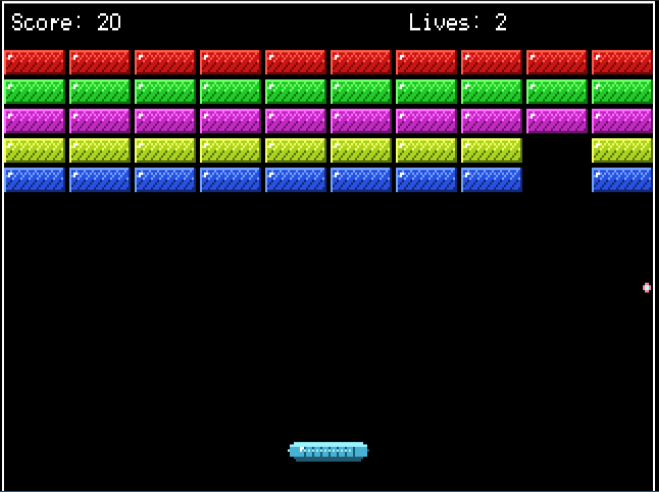

# CRUZKANOID DOS CLONE

A classic brick-breaking game written in C for DOS. The home page is in [morhook.itch.io/cruzkanoid](https://morhook.itch.io/cruzkanoid). For downloading compiled versions, go there.


## Screenshots




## Features
- 320x200 VGA graphics (Mode 13h)
- 5 rows x 10 columns of colorful bricks
- Paddle controls with arrow keys
- Ball physics with paddle spin
- Score tracking
- 3 lives
- Sound effects (PC speaker, optional Sound Blaster)
- Win/lose conditions

## Controls
- Left Arrow: Move paddle left
- Right Arrow: Move paddle right
- Space: Launch ball
- S: Toggle sound effects
- M: Toggle soundtrack
- Esc: Quit game

## Running
Run the game in a real DOS machine, DOSBox or Dosbox-x:
```sh
cruzkan.exe
```

Remember to configure your SoundBlaster with something like:
```
set BLASTER=A220 D1 H5 P330 T6
  
```

or else you'll hear the PC Speaker version (protect your ears!)

## Game Rules
- Destroy all bricks to win
- Don't let the ball fall below the paddle
- Each brick is worth 10 points
- Ball direction changes based on where it hits the paddle

## Technical Details
- Uses VGA Mode 13h (320x200, 256 colors)
- Direct VGA memory manipulation at 0xA000:0000
- BIOS interrupts for keyboard input
- Real-time gameplay with delay timing
- Sound: tries Sound Blaster DSP (8-bit DMA) using the `BLASTER` env var, falls back to PC speaker

# Development

Read (BUILD.md)[BUILD.md] for more info on building, running and contributing
